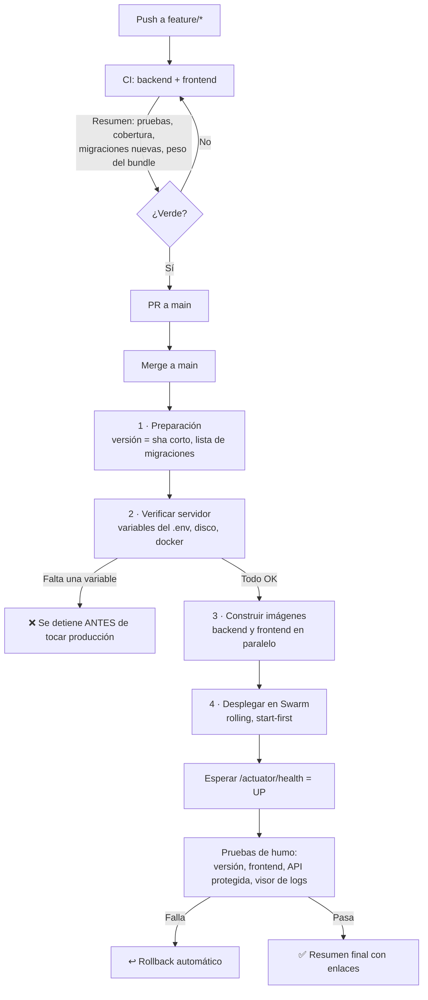

# CI/CD y observabilidad — Delivery Planner

Cómo se valida, se despliega y se vigila la aplicación. Todo lo que pasa queda visible en tres lugares:

| Quiero ver… | Dónde |
|---|---|
| Si mi rama compila y pasa pruebas | GitHub → Actions → **CI** → pestaña *Summary* |
| Qué se desplegó, con qué variables y si quedó sano | GitHub → Actions → **Deploy a producción** → *Summary* |
| Qué está haciendo la app ahora mismo | https://logs.delivery-planner.bystepsolutions.tech (usuario y clave) |

---

## 1. El flujo completo



**Lo importante:** si falta una variable en el servidor, el despliegue se detiene en el paso 2, cuando producción todavía está intacta. Antes, se enteraba uno con la app caída.

---

## 2. Dónde vive cada variable

La regla es simple: **si se necesita para construir, va en GitHub. Si se necesita para ejecutar, va en Dokploy.**

### GitHub → Settings → Secrets and variables → Actions

| Secret | Para qué |
|---|---|
| `SSH_HOST`, `SSH_USER`, `SSH_PRIVATE_KEY` | Entrar al VPS a desplegar |
| `GHCR_TOKEN` | Descargar las imágenes en el servidor |
| `GOOGLE_CLIENT_ID` | Se hornea en el bundle de Angular (login con Google) |
| `FIREBASE_API_KEY`, `FIREBASE_AUTH_DOMAIN`, `FIREBASE_PROJECT_ID`, `FIREBASE_STORAGE_BUCKET`, `FIREBASE_MESSAGING_SENDER_ID`, `FIREBASE_APP_ID`, `FIREBASE_VAPID_KEY` | Configuración del navegador para notificaciones push |

> Estas son de **build**: Angular las compila dentro del archivo JavaScript, así que no pueden vivir en Dokploy.

### Dokploy → proyecto → Environment (archivo `.env` del stack)

| Variable | Obligatoria | Para qué |
|---|---|---|
| `DB_HOST`, `DB_PORT`, `DB_NAME`, `DB_USERNAME`, `DB_PASSWORD` | sí | Base de datos (Supabase) |
| `JWT_SECRET`, `JWT_EXPIRATION_MS` | sí / no | Sesiones |
| `GOOGLE_CLIENT_ID` | sí | Validar el token de Google en el backend |
| `CORS_ALLOWED_ORIGINS` | sí | Dominios que pueden llamar a la API |
| `MAIL_HOST`, `MAIL_PORT`, `MAIL_USERNAME`, `MAIL_PASSWORD` | sí | Correos (invitaciones, avisos) |
| `FIREBASE_SERVICE_ACCOUNT_JSON`, `FIREBASE_STORAGE_BUCKET` | sí | Push y almacenamiento de fotos |
| `APP_DISPLAY_NAME`, `APP_URL`, `PLATFORM_ADMIN_EMAIL` | sí | Identidad de la app y admin de plataforma |
| `DOZZLE_AUTH` | sí | Usuario y clave del visor de logs (ver más abajo) |
| `WHATSAPP_CREDENTIALS_KEY` | recomendada | Cifra los tokens de WhatsApp de cada organización |
| `WHATSAPP_ENABLED`, `WHATSAPP_DRY_RUN`, `WHATSAPP_GRAPH_VERSION` | no | Interruptores del módulo WhatsApp |
| `BACKEND_URL` | no | Destino del proxy del frontend (por defecto `backend:8084`) |

El pipeline revisa esta lista en cada despliegue y te dice cuáles faltan, **sin mostrar nunca los valores**.

---

## 3. Visor de logs (Dozzle)

Servicio nuevo en el stack: una web donde se ven los logs del backend y del frontend en vivo, con filtro y búsqueda. Solo lectura.

**Puesta en marcha (una vez):**

1. **DNS:** crea un registro `A` para `logs.delivery-planner.bystepsolutions.tech` apuntando a la IP del VPS (igual que `api` y `app`).
2. **Usuario y clave:** genera el hash en el servidor y guárdalo en Dokploy como `DOZZLE_AUTH`:
   ```bash
   htpasswd -nbB anthony 'TU-CLAVE-LARGA'
   # salida: anthony:$2y$05$....  ← eso completo va en DOZZLE_AUTH
   ```
   Si no tienes `htpasswd`: `docker run --rm httpd:alpine htpasswd -nbB anthony 'TU-CLAVE-LARGA'`
3. Despliega. El propio pipeline comprueba que el visor responda **401 sin clave**; si quedara abierto, el despliegue falla.

**Ojo con esto:** Dozzle lee el socket de Docker. Está filtrado a los contenedores de Delivery Planner y protegido con clave, pero trátalo como una consola de administración: clave larga y no la compartas.

---

## 4. Cómo leer un despliegue

En Actions → *Deploy a producción* → *Summary* vas a ver, en orden:

1. **Versión y migraciones** que trae ese despliegue.
2. **Tabla de variables** del servidor (✅ definida / ❌ falta) y estado de disco, memoria y docker.
3. **Imágenes publicadas** con su etiqueta (el sha corto).
4. **Pruebas de humo:** versión desplegada, frontend responde, API protegida sin token, visor de logs con clave.
5. **Enlaces** a la app, al health y a los logs.

Para confirmar a mano qué versión está corriendo:

```bash
curl -s https://api.delivery-planner.bystepsolutions.tech/actuator/info
# {"app":{"name":"DeliveryPlanner","version":"b936fa6","deployedAt":"2026-09-12T17:03:11Z"}}
```

---

## 5. Si algo sale mal

| Situación | Qué hace el sistema | Qué haces tú |
|---|---|---|
| Falta una variable | Se detiene antes de desplegar | La agregas en Dokploy y relanzas el workflow |
| La imagen no compila | Se detiene, producción intacta | Corriges y vuelves a hacer push |
| El backend no llega a `UP` | Rollback automático a la versión anterior | Miras los logs en Dozzle y el resumen |
| Una prueba de humo falla | Rollback automático | Igual que arriba |
| Quieres volver atrás a mano | — | `ssh` al VPS y `docker service rollback delivery-planner_backend` |

Relanzar un despliegue sin cambiar código: Actions → *Deploy a producción* → **Run workflow**.
